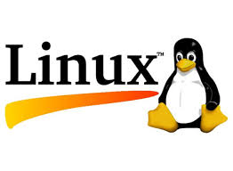
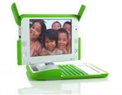

# Open Source World

## Licenses

* Open Licenses or Copyright?
* Why open Licences?
* CC Licenses
* [How to Choose a License](http://creativecommons.org/choose/?lang=en) ([More details](http://choosealicense.com/))

## Open Source

  * What is open-source?
  * Only for code?
  * What can I do with open Tools?
  * Only for small projects?
    * Linux
    * 3D Printers

  * We teach to the children  that ...
      * They can control the tools
      * Using illegal software is not OK...

  * They are free
  * Low costs
  * Invert the money in what it really worth
  * Multiplatform

# Projects open-source

## wikibooks

* [ICT in education](https://en.wikibooks.org/wiki/ICT_in_Education)

## Slideshare

* [ICT in education](http://www.slideshare.net/manaseducation/ict-in-education-41611729)

## Linux

80% of Internet's server uses Linux or free software

* Apache Web server

* [History](https://en.wikipedia.org/wiki/History_of_Linux):
  * In 1991, [Linus Torvalds](https://en.wikipedia.org/wiki/Linus_Torvalds) starts some tests
  * Now more than 18.000.000 lines of

## [Raspberry](http://raspberrypi.org):

  * Low cost (25$) computer that every child can use at home & school.
  * It has not cover in order to fire the curiosity
  * Several millions have been sold...

## [One Laptop Per Child (OLPC)](http://one.laptop.org/)

* No need of electricity (hand crank)
* Robust
